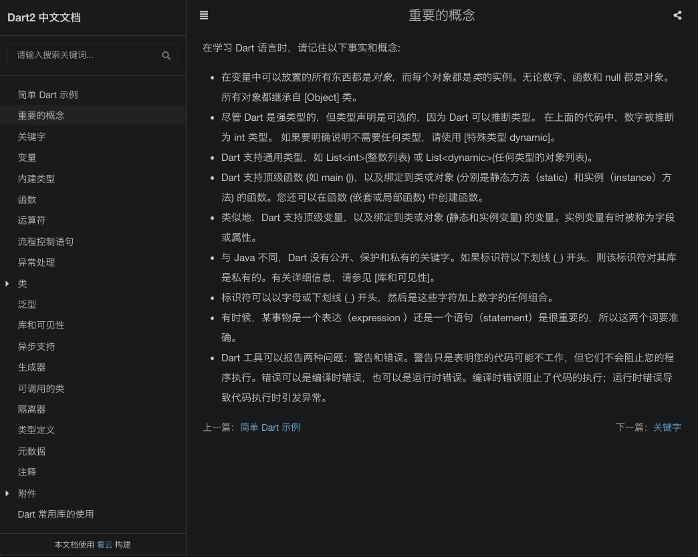
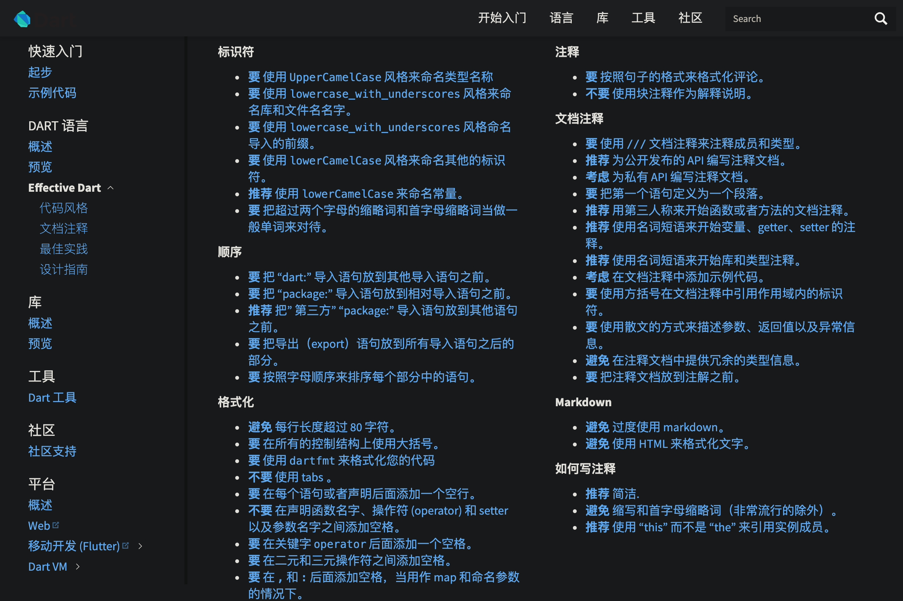
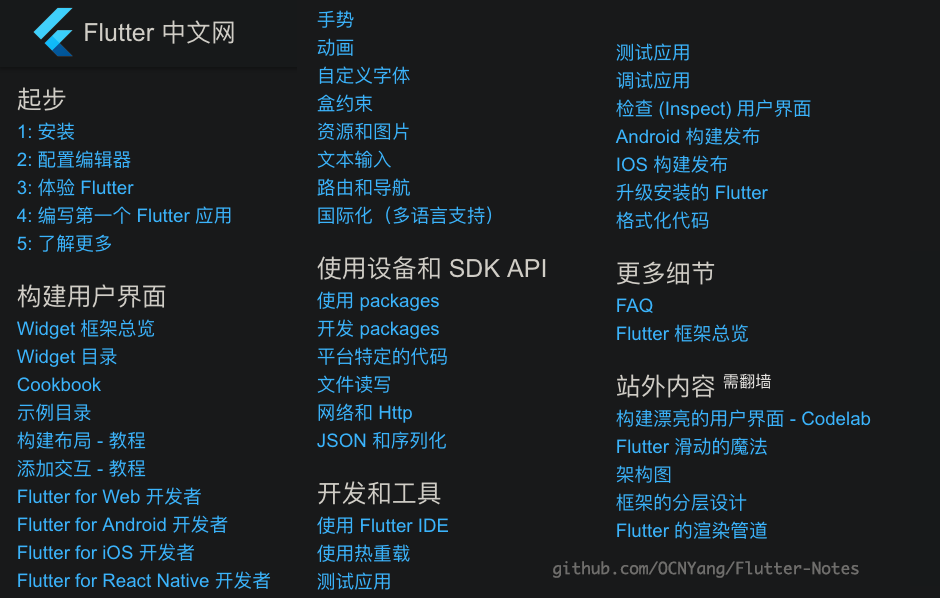
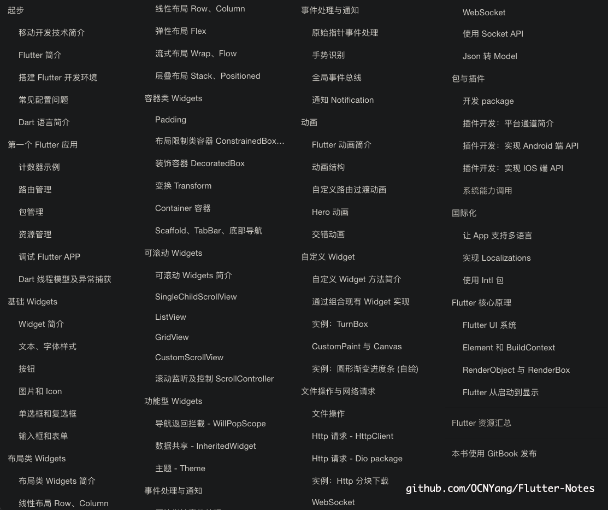
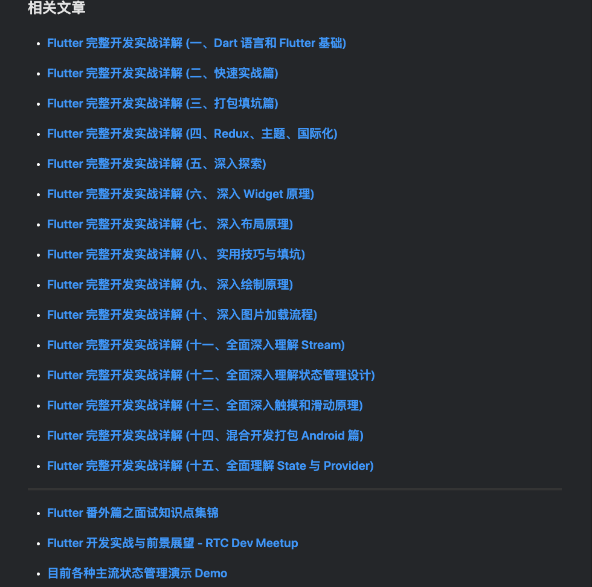
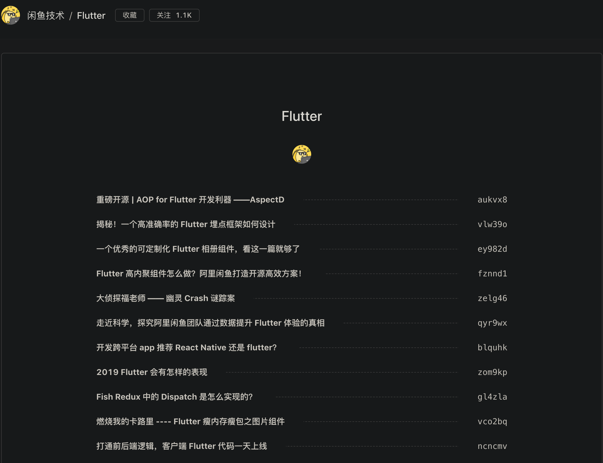
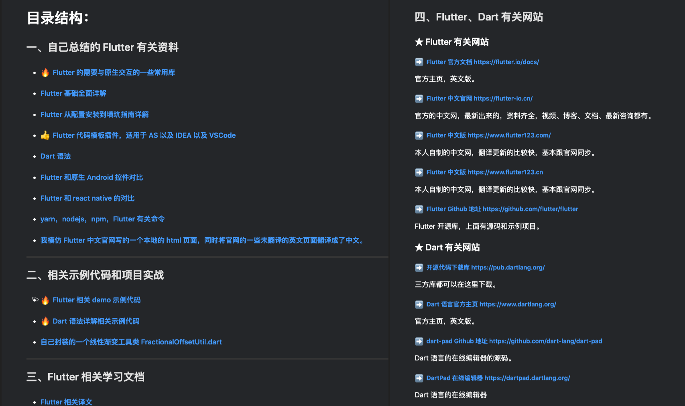
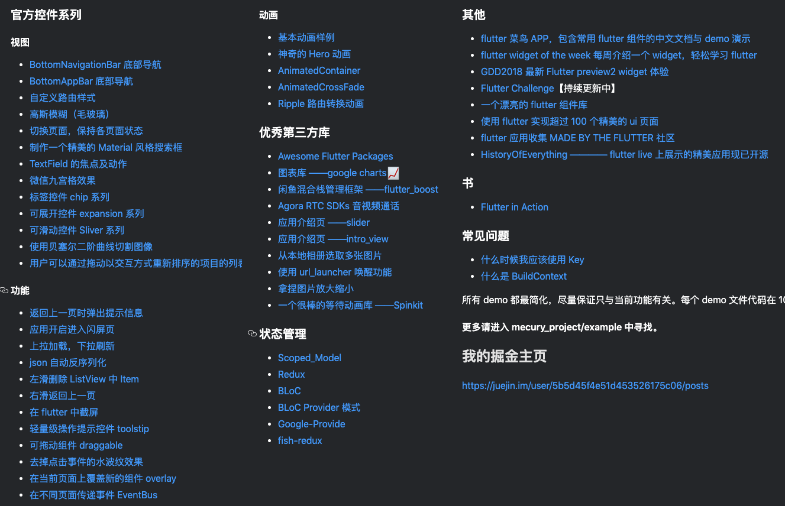

# Flutter-Notes
  

收集学习 Flutter 不错的教程。

## 教程

| Dart | 说明 | 概述 |
| :---: | :--- | :---: |
| [Dart 2 中文文档](https://www.kancloud.cn/marswill/dark2_document/) | ***Dart 2 文档中文版：*** Dart 语言很简单，可以很快上手。 |  |
| [Dart 编程语言中文网](http://dart.goodev.org/) | ***Effective Dart：*** **1.** 代码风格； **2.** 文档注释； **3.** 最佳实践； **4.** 设计指南。 |  |

| Flutter | 说明 | 概述 |
| :---: | :--- | :---: |
| [Flutter 中文网](https://flutterchina.club)  | ***官方入门教程中文版：***  **1.** 对 Flutter 整体的简介; **2.** 学习 Flutter 常用的基础控件; **3.** 和 Android、iOS 开发做对比。 |  |
| [Flutter 实战](https://book.flutterchina.club/)  | ***一本更加详细完善的介绍 Flutter 的入门教程书籍*** |  |
| [GSYGithubAppFlutter](https://github.com/CarGuo/GSYGithubAppFlutter)  | ***一款完整的开源 GitHub 客户端：*** 此开源 App 有对应的详解文章，比较注重实战的教程。 |  |
| [闲鱼技术/Flutter](https://www.yuque.com/xytech/flutter)  | ***闲鱼技术团队关于 Flutter 的博客文章列表：*** **1.** Flutter 混合开发方案探究； **2.** 部分原理深入解析；  因为是博客列表，技术点比较散 |  |
| [Flutter-learning](https://github.com/AweiLoveAndroid/Flutter-learning) | ***一些 Flutter 学习资料，库作者总结*** |  |
| [Flutter-Notebook](https://github.com/OpenFlutter/Flutter-Notebook) | ***许多 Flutter 相关功能 Demo 的集合，快速学习一些零碎的知识*** |  |

## 开源库

### 官方开源库
* 

### 第三方开源库
* 

## Demo

| 名称 | 介绍 |
| :---: | :--- |
| [**flutter_gallery**](https://github.com/flutter/gallery)  | ***官方开源地址中的 Demo：*** **1.** 常用控件的常见场景的实现； **2.** 几则比较高级场景的实现演示； **3.** 在动画、2D场景、图片格式、媒体等方面展示 Flutter 全面功能。  官方出品，必是精品，也能看出 Google 的良苦用心 |
| [**flutter-go**](https://github.com/alibaba/flutter-go) | ***阿里开源的关于介绍控件使用 Demo：*** **1.** 基本上包含了绝大多数的控件[目前总 Widgets 数：145，此库宣称覆盖140+ 组件]； **2.** Demo 中多是对控件（构造函数）基本用法介绍； **3.** 推荐直接下载 App 观看学习，控件模块源码学习价值不大，可以查看应用整体实现 |
| [**GSYGithubAppFlutter**](https://github.com/CarGuo/GSYGithubAppFlutter)  | ***超完整的开源 GitHub 客户端：*** **1.** 功能上覆盖面广，实战性很强； **2.** 有很多开源库的实际使用； **3.** 有对应的系列详解文章； **4.** 并且很难得的是有同款 Weex 版、ReactNative 版、Android Kotlin 版，也可对比使用。 |
| [**FlutterExampleApps**](https://github.com/iampawan/FlutterExampleApps) | ***TodoMVC for Flutte：*** 演示了如何构建代码、设计架构，便于测试和维护应用。 |
| --- | --- |
| [**HistoryOfEverything**](https://github.com/2d-inc/HistoryOfEverything) | ***万物起源（由 2Dimensions 实现的 Flutter 客户端）：*** 官方展示的十分精美炫酷的动画应用。 |
| [**flutter-ui-nice**](https://github.com/nb312/flutter-ui-nice) | ***展示了 130+ 精美页面的实现*** |
| [**flutter-osc**](https://github.com/yubo725/flutter-osc) | ***开源中国客户端*** 支持 Android 和 iOS |
| [**flutter_wanandroid**](https://github.com/Sky24n/flutter_wanandroid) | ***WanAndroid 客户端*** 包括 BLoC、RxDart 、国际化、主题色、启动页、引导页，拥有较好的项目结构 & 比较规范的代码！ |
| [**FlutterDouBan**](https://github.com/kaina404/FlutterDouBan) | ***100% 还原豆瓣客户端*** |

